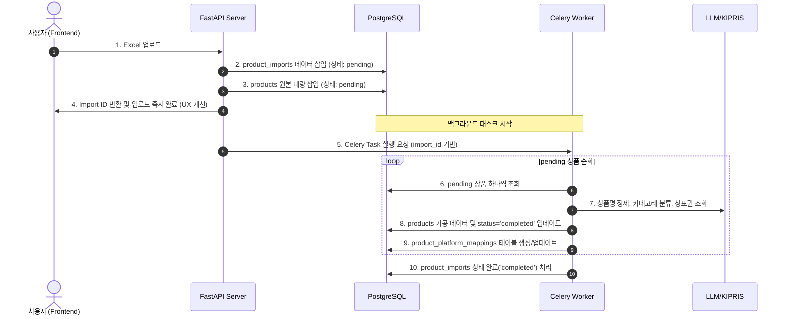

# 상품 DB 마이그레이션 및 확장 가능한 스키마 설계안

**작성일:** 2026-05-20  
**상태:** 제안됨 (Proposed)  
**목표:** 엑셀 업로드-다운로드 기반의 단발성 가공 시스템을 PostgreSQL DB 기반 상품 관리 시스템으로 고도화하며, 향후 판매 채널(네이버, 쿠팡 외 11번가, 지마켓, 쇼피파이 등) 확장에 유연하게 대응할 수 있는 확장형 아키텍처를 설계합니다.

---

## 1. 핵심 아키텍처 원칙 (Extensibility Guidelines)

1. **핵심(Core)과 플랫폼(Platform)의 관심사 분리**
   * 상품 본연의 정보(이름, 정제명, 원가, 상태, 이미지 등)는 `products` 테이블에 관리합니다.
   * 특정 마켓플레이스(네이버, 쿠팡 등)와 관련된 카테고리 매핑, 노출 속성, 마켓 상품 ID 등은 별도의 일대다(1:N) 테이블인 `product_platform_mappings`에서 전담합니다.
   * 새로운 마켓 채널이 추가되더라도 `products` 테이블 스키마를 변경(Alter)할 필요 없이 매핑 테이블에 새로운 행만 추가하여 즉시 대응합니다.

2. **비정형/유연한 속성을 위한 JSONB 적극 활용**
   * 마켓플레이스마다 요구하는 전용 속성(예: 옵션 구조, 네이버 구매평수, 쿠팡 배송 유형 등)은 관계형 컬럼 대신 PostgreSQL의 `JSONB` 컬럼(`mapped_attributes`, `raw_metadata`)으로 흡수합니다.
   * `JSONB`는 인덱싱(GIN Index)이 지원되어 유연하면서도 빠른 쿼리가 가능합니다.

3. **가공 이력 및 배치 트래킹 지원**
   * 상품이 어떤 배치 파일(업로드된 엑셀)을 통해 유입되었는지 추적하기 위해 `product_imports` 테이블을 도입합니다.
   * 사용자는 언제든 업로드 이력별로 롤백하거나 가공 이력을 추적할 수 있습니다.

---

## 2. 데이터베이스 스키마 설계 (DDL Specification)

### A. 엑셀 업로드 배치 트래킹 테이블 (`product_imports`)
사용자가 일괄 등록한 엑셀 업로드 내역을 관리합니다.
```sql
CREATE TABLE product_imports (
    id UUID PRIMARY KEY DEFAULT gen_random_uuid(),
    user_id UUID NOT NULL REFERENCES users(id) ON DELETE CASCADE,
    filename VARCHAR(255) NOT NULL,
    total_count INTEGER DEFAULT 0,
    success_count INTEGER DEFAULT 0,
    failed_count INTEGER DEFAULT 0,
    status VARCHAR(20) DEFAULT 'pending', -- 'pending', 'processing', 'completed', 'failed'
    created_at TIMESTAMP WITH TIME ZONE DEFAULT CURRENT_TIMESTAMP,
    updated_at TIMESTAMP WITH TIME ZONE DEFAULT CURRENT_TIMESTAMP
);

CREATE INDEX idx_product_imports_user_id ON product_imports(user_id);
```

### B. 공통 상품 테이블 (`products`)
특정 채널에 의존하지 않는 상품 순수 도메인 모델입니다.
```sql
CREATE TABLE products (
    id UUID PRIMARY KEY DEFAULT gen_random_uuid(),
    user_id UUID NOT NULL REFERENCES users(id) ON DELETE CASCADE,
    import_id UUID REFERENCES product_imports(id) ON DELETE SET NULL,
    
    -- 기본 상품 정보
    original_name VARCHAR(255) NOT NULL,          -- 원본 상품명
    refined_name VARCHAR(255),                    -- AI 정제 상품명
    brand_name VARCHAR(100),                      -- 추출된 브랜드명
    
    -- 가공 결과 데이터
    keywords TEXT[],                              -- 정제 키워드 리스트
    status VARCHAR(20) DEFAULT 'pending',         -- 가공 상태: 'pending', 'processing', 'completed', 'failed'
    warnings JSONB,                               -- 상표권 위반 의심 키워드 등 경고 정보
    
    -- 유연한 비정형 데이터
    raw_metadata JSONB,                           -- 원본 엑셀 행 전체 정보 또는 크롤링 이미지 경로 등
    
    -- 메트릭스 및 메타 정보
    processing_time_ms INTEGER,                   -- 가공 소요 시간
    created_at TIMESTAMP WITH TIME ZONE DEFAULT CURRENT_TIMESTAMP,
    updated_at TIMESTAMP WITH TIME ZONE DEFAULT CURRENT_TIMESTAMP
);

-- 인덱스 설계
CREATE INDEX idx_products_user_id ON products(user_id);
CREATE INDEX idx_products_status ON products(status);
CREATE INDEX idx_products_import_id ON products(import_id);
CREATE INDEX idx_products_created_at ON products(created_at);
-- 키워드 고속 검색을 위한 GIN 인덱스
CREATE INDEX idx_products_keywords ON products USING gin(keywords);
```

### C. 플랫폼별 매핑 테이블 (`product_platform_mappings`)
네이버, 쿠팡, 쇼피파이 등 마켓플레이스별 매핑 설정 및 등록 상태를 별도로 추적합니다.
```sql
CREATE TABLE product_platform_mappings (
    id UUID PRIMARY KEY DEFAULT gen_random_uuid(),
    product_id UUID NOT NULL REFERENCES products(id) ON DELETE CASCADE,
    platform_name VARCHAR(50) NOT NULL,           -- 'naver', 'coupang', 'shopify', '11st' 등
    
    -- 플랫폼 전용 카테고리 정보
    category_id VARCHAR(50),                      -- 플랫폼측 카테고리 고유 식별자
    category_path VARCHAR(255),                   -- 플랫폼측 사람이 읽기 좋은 카테고리 경로
    
    -- 마켓 등록 결과 정보
    platform_product_id VARCHAR(100),             -- 오픈마켓 실제 등록 시 반환받은 상품 고유 ID
    sync_status VARCHAR(20) DEFAULT 'draft',      -- 'draft', 'synced', 'failed'
    sync_error TEXT,                              -- 동기화 실패 시 에러 사유
    
    -- 플랫폼 전용 추가 비정형 속성
    mapped_attributes JSONB,                      -- 검색 태그, 옵션 리스트, 배송 템플릿 정보 등
    
    created_at TIMESTAMP WITH TIME ZONE DEFAULT CURRENT_TIMESTAMP,
    updated_at TIMESTAMP WITH TIME ZONE DEFAULT CURRENT_TIMESTAMP,
    
    -- 동일 상품이 한 플랫폼에 중복 맵핑되는 것 방지
    UNIQUE(product_id, platform_name)
);

CREATE INDEX idx_platform_mappings_product ON product_platform_mappings(product_id);
CREATE INDEX idx_platform_mappings_search ON product_platform_mappings(platform_name, sync_status);
```

---

## 3. 마이그레이션 실행 파이프라인 흐름 (FastAPI + Celery)



---

## 4. 확장 가능한 스키마 설계의 이점
* **신규 마켓 추가 용이성:** 네이버, 쿠팡 외에 다른 마켓(쇼피파이 등) 연동을 추가할 때 기존 백엔드 상품 로직이나 데이터 모델을 마이그레이션할 필요가 전혀 없으며, 단지 `product_platform_mappings` 엔티티 다형성 데이터만 적재하면 됩니다.
* **유연한 마켓 속성 매핑:** 카테고리 매핑 외에 플랫폼별로 요구하는 세부 속성(네이버의 친환경 여부, 쿠팡의 묶음 배송 여부 등)을 변경 불가능한 DB 테이블 컬럼 대신 `mapped_attributes` JSONB 컬럼에 주입하므로 프론트엔드 변경에 기민하게 대처할 수 있습니다.
* **부분 재시도 가능:** 엑셀 가공이 중간에 멈춰도 이미 완료된 상품은 건너뛰고 남은 `pending` 상태의 상품만 선별하여 백그라운드에서 재시작할 수 있어 API 요청 비용을 극적으로 아낍니다.

---

## 5. 멀티 컨테이너(독립 Docker) 간의 확장 및 공유 방안

추후 "상품 등록/마켓 동기화"와 같은 서비스가 독립된 별도의 Docker 컨테이너(예: `register-service`)로 구성되더라도, 본 DB 아키텍처는 완벽하게 확장 및 연동이 가능합니다.

1. **중앙 데이터베이스 공유 (Shared Database Pattern)**
   * PostgreSQL 컨테이너(`db`)는 독립적으로 실행되고 있으며 내부 Docker 네트워크 및 대외 포트 `5432`를 통해 접근 가능합니다.
   * 새로운 독립 Docker 컨테이너가 추가되더라도 동일한 Docker 네트워크 환경 내에서 동일한 PostgreSQL로 커넥션을 맺어 `products` 및 `product_platform_mappings` 테이블에 동시 읽기/쓰기가 가능합니다.

2. **느슨한 결합을 위한 REST API 호출 (Shared API Pattern)**
   * `processor` 서비스에서 표준화된 REST API(예: `GET /products`, `PATCH /products/{id}/status`)를 제공합니다.
   * 새로운 상품 등록용 독립 컨테이너가 직접 DB에 붙지 않고 격리되기를 원한다면, `processor` API를 웹훅(Webhook)이나 HTTP 통신으로 호출해 가공이 완료된(`status='completed'`) 상품 데이터를 가져가 마켓 등록에 활용할 수 있습니다.

3. **마켓 등록 모듈의 격리성**
   * 플랫폼 매핑 테이블(`product_platform_mappings`)에 `sync_status` 및 `platform_product_id`를 미리 설계해 두었으므로, 독자적인 상품 등록 서비스가 이 테이블의 상태 데이터를 갱신(Update)해가며 마켓 API 송수신 업무를 단독 수행하기에 매우 적합합니다.
