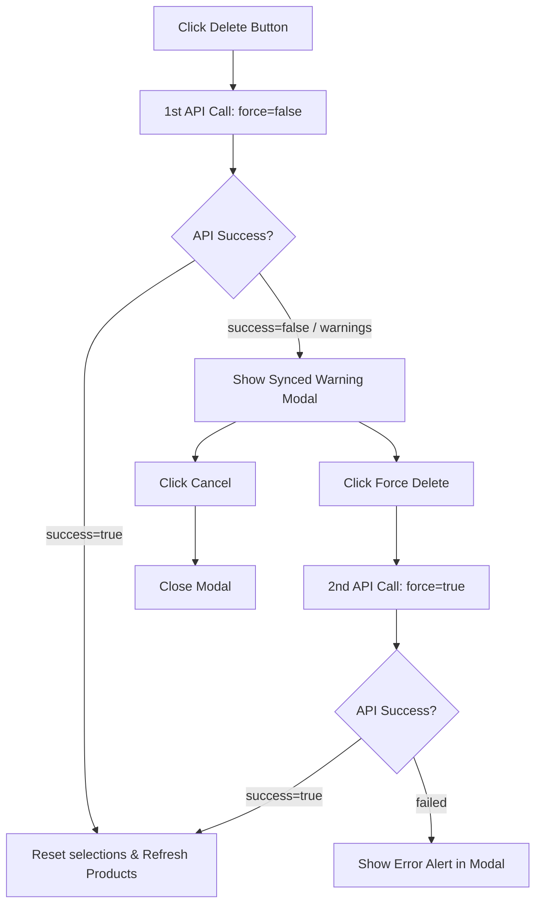

# Product Deletion Feature Specification

This document defines the specification and design for the safe product deletion feature in the **Auto-Selp** Product Management tab. It includes multi-mode deletion (selected products & wholesale sites) and safety logic to warn the user before deleting products already synced with market platforms.

---

## 1. Background & Objectives
As the project transitioned to a PostgreSQL-based product management workflow, users need a way to clean up, reset, or prune products. 
However, simply deleting a product from the database that is **already listed on Naver Smart Store or Coupang Wing** creates sync discrepancies: future stock/price smart updates will fail.
* **Objective:** Enable efficient bulk deletion of checked products and entire wholesale sites.
* **Safety First:** Warn the user when they attempt to delete products already synced to market platforms, allowing them to explicitly bypass (force-delete) or cancel.

---

## 2. API Design & Database Cascade

### A. Endpoint Specifications
* **Route:** `POST /products/delete`
* **Content-Type:** `application/json`
* **Request Body Schema (`ProductDeleteRequest`):**
  ```json
  {
    "product_ids": ["uuid-1", "uuid-2"],
    "wholesale_site_id": "wholesale-uuid",
    "force": false
  }
  ```
  *(Note: Either `product_ids` or `wholesale_site_id` must be provided, but not both.)*

* **Response Body Schema (`ProductDeleteResponse`):**
  ```json
  {
    "success": true,
    "deleted_count": 5,
    "warning_synced_count": 0,
    "message": "성공적으로 삭제되었습니다."
  }
  ```
  *When `force=false` and synced items exist:*
  ```json
  {
    "success": false,
    "deleted_count": 0,
    "warning_synced_count": 3,
    "message": "마켓에 동기화된 상품이 존재합니다."
  }
  ```

### B. Backend Deletion Flow
1. **Fetch Target Products:** Query target products based on `product_ids` or `wholesale_site_id`.
2. **Count Synced Platform Mappings:** Check if there are associated `ProductPlatformMapping` rows where `sync_status == 'synced'`.
3. **Safety Gate:** If `warning_synced_count > 0` and `force == false`, return a `200 OK` response with `success: false` and the count.
4. **Execution:** If `warning_synced_count == 0` or `force == true`, perform hard delete.
   * `Product` model has `platform_mappings` defined with `cascade="all, delete-orphan"`.
   * Deleting the `Product` rows automatically cascades down and cleans up `ProductPlatformMapping` records.

---

## 3. Frontend UI/UX Design

### A. Toolbar Buttons
* **Selected Deletion:** 
  * Appears in the table's action toolbar when `selectedIds.size > 0`.
  * Styled with a subtle red-tint outline or minimalist alert state to signal deletion.
* **Wholesale Deletion:**
  * Enabled when `wholesaleFilter` has a selected wholesale site ID.
  * Labeled `"현재 도매처 상품 전체 삭제"` and placed safely to prevent accidental clicks.

### B. Apple-inspired Warning Modal (`DeleteConfirmModal`)
The modal uses clean aesthetics, micro-transitions, and frosted-glass visuals (`backdrop-filter: blur(10px)`).

#### State 1: Standard Deletion (No synced products found)
* **Title:** `"상품 삭제"`
* **Description:** `"선택한 상품 {count}개를 완전히 삭제하시겠습니까? 이 작업은 되돌릴 수 없습니다."`
* **Buttons:** `[취소]` (Slate outline), `[삭제하기]` (Standard danger red button)

#### State 2: Synced Warning (Synced products found)
* **Title:** `"⚠️ 경고: 마켓 연동 상품 포함"`
* **Description:** `"삭제 대상 중 이미 스마트스토어/쿠팡에 등록(동기화) 완료된 상품 {warning_synced_count}개가 포함되어 있습니다. DB에서 삭제 시 향후 가격/재고 스마트 갱신 관리가 불가능합니다. 정말로 연동 데이터를 포함해 모두 강제로 삭제하시겠습니까?"`
* **Buttons:** `[아니오 (취소)]` (Prominent brand color button), `[예, 강제로 삭제]` (Bright red action text/button)

### C. Frontend Deletion State Machine


---

## 4. Implementation Steps
1. **Backend Integration:**
   * Add request/response schemas in `services/processor/schemas.py`.
   * Add `/products/delete` endpoint in `services/processor/main.py`.
2. **Frontend Integration:**
   * Create `DeleteConfirmModal.tsx` in `frontend/src/components/` or inline in `page.tsx`.
   * Add modal states and `handleDeleteProducts` logic in `frontend/src/app/(ai-mall)/products/page.tsx`.
   * Embed deletion buttons in the product list page toolbar.
3. **Verification & Tests:**
   * Verify via sandbox db queries that deleted products and their associated mappings are successfully cascades-removed.
