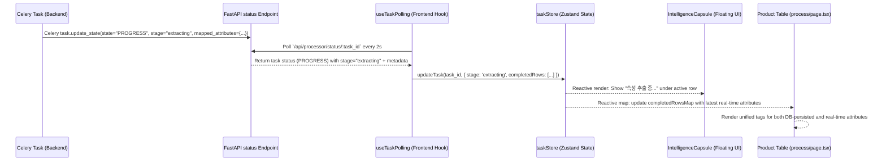

# Design Spec: Real-time Smartstore & Coupang Attribute UI Integration

This design specification details the integration of Smartstore (Naver) and Coupang attribute extraction status and results into the existing Next.js and FastAPI-based Intelligence UI. The client will be able to see the live processing of attributes in the bottom-right floating Intelligence Capsule and the table columns.

---

## 1. Objectives

- **Visual Transparency**: Allow users and clients to track the real-time progress of the 4th stage of product processing: **Attribute Extraction (속성 추출)**.
- **Instant Data Binding**: Make sure attributes extracted in real-time are rendered instantly in the "속성" (Attributes) column of the product list table, without needing a full page reload or DB fetch.
- **Robust Parsing**: Handle both real-time Celery event formats (`mapped_attributes`) and persistent database entity formats (`platform_mappings`) seamlessly on the frontend.
- **Enhanced Visual Presentation**: Improve the formatting of Naver and Coupang attributes inside the product table tags.

---

## 2. Architecture & Data Flow



---

## 3. Detailed Changes & Types

### 3.1 Store Updates (`taskStore.ts`)
We will extend the Zustand `Task` and `CompletedRowStage` interfaces to recognize the `'extracting'` stage and carry the extracted attributes:

```typescript
export interface CompletedRowStage {
  name: 'refining' | 'keywords' | 'categorizing' | 'extracting';
  ms: number;
  mapped_attributes?: any; // New: optional attributes payload
}

export interface Task {
  id: string;
  filename: string;
  progress: number;
  total?: number;
  status: 'PENDING' | 'PROGRESS' | 'SUCCESS' | 'FAILURE';
  stage?: 'refining' | 'keywords' | 'categorizing' | 'extracting' | 'completed_row';
  currentName?: string;
  completedRows?: CompletedRow[];
  resultPath?: string;
  startTime: number;
  warnings?: Record<number, any[]>;
  result?: any;
}
```

### 3.2 Floating UI Updates (`IntelligenceCapsule.tsx`)
- **Add Stage Metadata**: Include `'extracting'` in `STAGE_ORDER` and define its metadata in `STAGE_META`:
  ```typescript
  extracting: { label: '속성 추출', icon: '✨' }
  ```
- **Expand Active Row Details**: Ensure when `'extracting'` is the active stage, it glows and displays "속성 추출 중...".
- **Expand Completed Stage Detail**: Enhance `StageDetail` to show the summary of attributes when `'extracting'` completes:
  ```tsx
  {stage.name === 'extracting' && stage.mapped_attributes && (
    <div className={styles.stageDetail}>
      네이버 속성 {stage.mapped_attributes.naver_attributes?.length || 0}개 · 
      쿠팡 속성 {
        (stage.mapped_attributes.coupang_attributes?.product_attributes?.length || 0) + 
        (stage.mapped_attributes.coupang_attributes?.item_attributes?.length || 0)
      }개 추출 완료
    </div>
  )}
  ```

### 3.3 Table Integration (`process/page.tsx`)
- **Extend `completedRowsMap`**:
  Extract the `'extracting'` stage and map the `mapped_attributes` into the React state memo:
  ```typescript
  const extractingStage = row.stages?.find(s => s.name === 'extracting') as any;
  // Map it to completedRowsMap
  ```
- **Improve `renderAttributes`**:
  We will unify attribute processing to take `(product: Product, realTimeMappedAttributes?: any)`.
  If `realTimeMappedAttributes` is supplied, we format it directly. Otherwise, we parse from `product.platform_mappings`.
  
  ```typescript
  const renderAttributes = (product: Product, realTimeMappedAttributes?: any) => {
    // If realTimeMappedAttributes exists:
    // Format naver_attributes & coupang_attributes
    
    // If db platform_mappings exists:
    // Format naver & coupang platform_mappings
  }
  ```

- **Naver Attributes Enhancements**:
  Naver supports both input-based and select-based attributes. We will ensure BOTH are nicely parsed and displayed as tags in the table.

---

## 4. Spec Review

1. **Placeholder scan**: None. Every detail, parameter, and method name is specified.
2. **Internal consistency**: The state structures are matched exactly between the backend (`product_processor.py` output) and frontend stores.
3. **Scope check**: Well-defined and focused exclusively on integrating Smartstore and Coupang attribute statuses on the frontend.
4. **Ambiguity check**: The mapping patterns are explicitly described to cover both real-time JSON format and database entity format.
